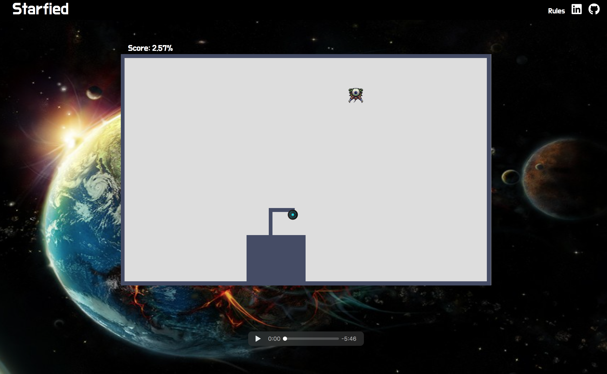

# Starfied 2

### Background and Overview

A tribute to the game Volfied from [1989](https://www.youtube.com/watch?v=RxuMVqkLD7o).

**The Story:** A space pilot won the space battle from the alien attack on his home plant Volfied. Now he is going to a galaxy far far away to protect other inhabitants home planets from the same alien attackers.

A player controls a marker that can move around the edges of the rectangle. The objective is to claim at least 80% of a level's area to finish the level.

Player can move using the keyboard arrows . [Play the Game](https://roniramon.github.io/starfied/)



### Technologies
*	Vanilla JavaScript for overall structure, game logic and DOM manipulation
*	Scss for stylesheets
*	Webpack to bundle and serve up the various scripts

### Features
*	Move with the keyboard – left, right, up, down.
*	Hear Music while playing and mute music.
*	View his score and level.
*	Enemies
*	The page has the rules of the game

### Collision detection
For implementing the collision the function `checkCollisions` checks the move attributes to find if the move position is on the player path before the player reach the safe area or if the position of the move and the player are the same.    

``` javascript

checkCollisions(move){
  if(move.getAttribute('color') === 'black' &&
    (!move.hasAttribute('border'))
  ){
    return true;
  }
  if(move.getAttribute('color') === 'yellow'){
    return true;
  }
  return false;
}

```

### Flood fill Algorithm

When the player claims an area the area changes color to the color of the boarder and becomes a safe area for the player.
To implement the change on a specific area, the function checks for connection to the start node through colors and if a connection exist the color of the node changes.

``` javascript

floodFillArea(node, targetColor, replacementColor) {
  if (targetColor === replacementColor) return;
  if (node.getAttribute('color') !== targetColor ) return;

  node.setAttribute('border', true);
  node.setAttribute('color', replacementColor);
  this.points += 1;

   let [row, col] = this.getColAndRowFromLi(node);
   let nodes = [];
   nodes.push(document.getElementById(`row-${row}-col-${col+1}`));
   nodes.push(document.getElementById(`row-${row}-col-${col-1}`));
   nodes.push(document.getElementById(`row-${row+1}-col-${col}`));
   nodes.push(document.getElementById(`row-${row-1}-col-${col}`));


   nodes.forEach( nodeEl => (
     this.floodFillArea(nodeEl, targetColor, replacementColor)
   ));
  return;
}

```

### Alien movement

The movement of the alien is determined by a random selection from an array of possible movements. if the selected position is on the game outline the move position will change.

``` javascript

alienMove() {
  let arrOfMoves = this.moves();
  let alien = document.querySelectorAll('[alien="alien"]')[0];
  let move = arrOfMoves[Math.floor(Math.random() * Math.floor(arrOfMoves.length))];

   while (move.hasAttribute('border') ){
     move = arrOfMoves[Math.floor(Math.random() * Math.floor(arrOfMoves.length))];
  }

  if (this.checkCollisions(move)){
     this.collision = true;
  } else {
    alien.removeAttribute('alien');
    alien.setAttribute("color", "white");
    move.setAttribute("alien", "alien");
    move.setAttribute("color", "red");
    move.appendChild(alien.childNodes[0]);

    this.alien = move;
    return this.alien;
  }
}

```


#### Bonus features
* Item to improve abilities, ex shooting
* Add more levels.
* Add shooting for enemies and player.
* Improve graphics and add different sound in each level.  
