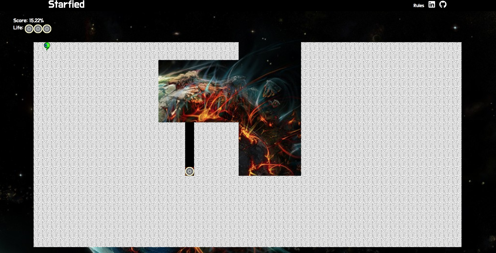

# Starfied 2

### Background and Overview

A tribute to the game Volfied from [1989](https://www.youtube.com/watch?v=RxuMVqkLD7o).

**The Story:** A space pilot won the space battle from the alien attack on his home plant Volfied. Now he is going to a galaxy far far away to protect other inhabitants home planets from the same alien attackers.

A player controls a marker that can move around the edges of the rectangle. The objective is to claim at least 80% of a level's area to finish the level.

Player can move using the keyboard arrows . [Play the Game](https://roniramon.github.io/starfied/)



## Technologies
*	Vanilla JavaScript for overall structure, game logic and DOM manipulation
*	Scss for stylesheets
*	Webpack to bundle and serve up the various scripts

### Features
*	Move with the keyboard: left, right, up, down.
*	Hear Music while playing and mute music.
*	View his score and level.
*	Enemies
*	The page has the rules of the game

### Collision detection
For implementing the collision the function `collision` checks the move position in the player and enemy class and change the state of the board class if found collision.    

``` javascript
//Player Class and Enemy Class
collision (){
  this.board.collision();
}

//board class
collision (){
  this.collisions = true;
}

```

### Flood fill Algorithm

When the player claims an area the area changes color to the color of the boarder and becomes a safe area for the player.
To implement the change on a specific area, the function checks for connection to the start position through values in the grid and if a connection exist the color of the position changes.

``` javascript

flood (coords){
  let coordsVal = this.getCellAt(coords);
  if (coordsVal === "1") return;

  this.setCellAt(coords, "1");
  this.points += 1;

  let diff = [[0,1], [0,-1], [-1,0], [1,0]];
  diff.forEach( options => {
    let newCoords = [coords[0] + options[0], coords[1] + options[1]];
    this.flood(newCoords);
  });
  return;
}

```

### Enemy movement

The movement of the enemy is determined by a random selection from an array of possible movements. if the selected position is on the game outline the move position will change.

``` javascript

moves (randomDiff){
  let diff;
  let moveTo;
  try {
    moveTo = [this.position[0] + randomDiff[0], this.position[1] + randomDiff[1]];
  }
  catch(err) {
    moveTo = this.position;
  }

  let moveVal = this.board.getCellAt(moveTo);
  while(moveVal === "1" || !this.board.validMove(moveTo)) {
    try {
      diff = this.random_move();
      moveTo = [this.position[0] + diff[0], this.position[1] + diff[1]];
    }
    catch(err) {
      moveTo = this.position;
    }
    moveVal = this.board.getCellAt(moveTo);
  }


```


#### Bonus features
* Item to improve abilities, ex shooting
* Add more levels.
* Add shooting for enemies and player.
* Improve graphics and add different sound in each level.  
